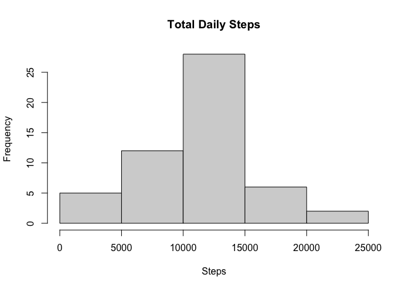
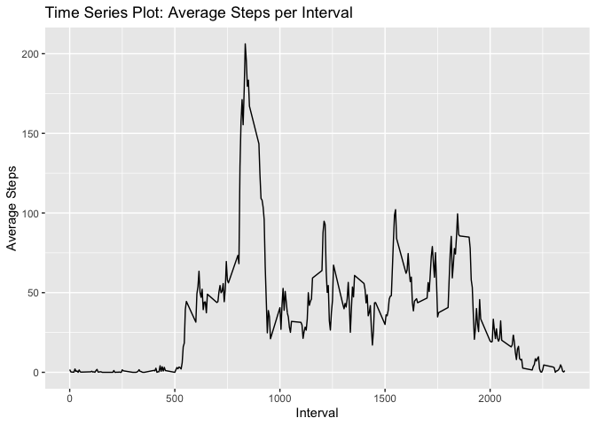
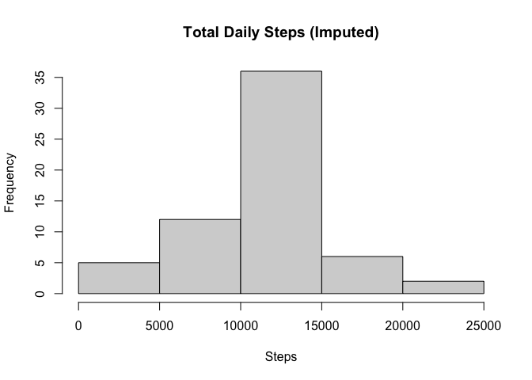
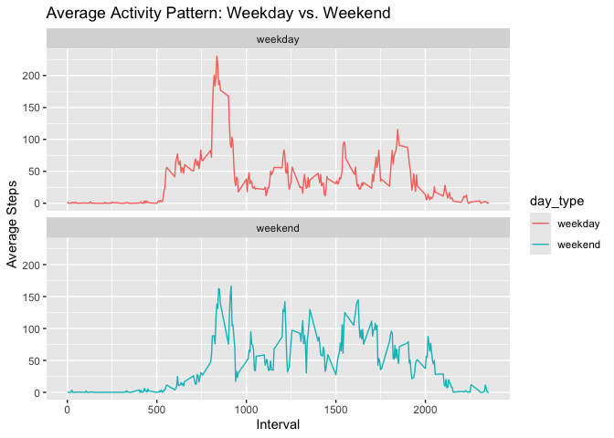

## Setting up code chunks and loading packages


``` r
knitr::opts_chunk$set(echo = TRUE)
library(ggplot2)
library(dplyr)
```

```
## 
## Attaching package: 'dplyr'
```

```
## The following objects are masked from 'package:stats':
## 
##     filter, lag
```

```
## The following objects are masked from 'package:base':
## 
##     intersect, setdiff, setequal, union
```

## Loading and preprocessing the data


``` r
# Loading the data
activity_data <- read.csv("activity.csv")

# Processing the data (converting date strings to Date objects)
activity_data$date <- as.Date(activity_data$date, 
                              format = "%Y-%m-%d")
```

## 1. What is mean total number of steps taken per day?


``` r
# Calculate total steps per day
daily_total <- aggregate(steps ~ date, 
                         activity_data, 
                         sum, na.rm = TRUE)
head(daily_total)
```

```
##         date steps
## 1 2012-10-02   126
## 2 2012-10-03 11352
## 3 2012-10-04 12116
## 4 2012-10-05 13294
## 5 2012-10-06 15420
## 6 2012-10-07 11015
```


``` r
# Make a histogram
hist(daily_total$steps, 
     main = "Total Daily Steps", 
     xlab = "Steps")
```

<!-- -->


``` r
# Calculate mean and median
mean_steps <- mean(daily_total$steps)
median_steps <- median(daily_total$steps)

mean_steps
```

```
## [1] 10766.19
```

``` r
median_steps
```

```
## [1] 10765
```

#### Written analysis for 1:

Therefore, based on the analysis of the total steps taken each day (ignoring missing values):

- Summary Statistics: The mean total number of steps taken per day is ``1.0766189\times 10^{4}``, and the median is ``10765``.
- Distribution: The histogram shows that the most frequent daily step count falls between 10,000 and 15,000 steps.

## 2. What is the average daily activity pattern?


``` r
# Calculate average steps per interval
steps_per_interval <- aggregate(steps ~ interval, 
                          activity_data, 
                          mean, na.rm = TRUE)
head(steps_per_interval)
```

```
##   interval     steps
## 1        0 1.7169811
## 2        5 0.3396226
## 3       10 0.1320755
## 4       15 0.1509434
## 5       20 0.0754717
## 6       25 2.0943396
```


``` r
# Time series plot
g <- ggplot (steps_per_interval, aes(x=interval, y=steps))
g + geom_line()+ 
  labs(title = "Time Series Plot: Average Steps per Interval", 
       x = "Interval", 
       y = "Average Steps")
```

<!-- -->


``` r
# Find the interval with the maximum number of steps
max_interval <- steps_per_interval[which.max(steps_per_interval$steps), ]

max_interval
```

```
##     interval    steps
## 104      835 206.1698
```

#### Written analysis for 2:

By averaging the number of steps across all days for each 5-minute interval:

- The Peak Interval: The 5-minute interval that contains the maximum number of steps, on average across all days, is interval ``835, 206.1698113``.
- Observation: This suggests a peak in activity during the morning hours, likely corresponding to a commute or morning exercise routine.

## 3. Imputing missing values


``` r
# Count missing values
total_nas <- sum(is.na(activity_data$steps))

# Fill nas with the mean of the 5-minute interval
imputed_data <- activity_data %>%
  group_by(interval) %>%
  mutate(steps = ifelse(is.na(steps), mean(steps, na.rm = TRUE), steps)) %>%
  ungroup()
```


``` r
# Calculating the imputed data
imputed_daily_total <- aggregate(steps ~ date, imputed_data, sum)

# Histogram
hist(imputed_daily_total$steps, 
     main = "Total Daily Steps (Imputed)", 
     xlab = "Steps")
```

<!-- -->


``` r
# Mean and median with imputed data
imputed_data_mean <- mean(imputed_daily_total$steps)
imputed_data_median <- median(imputed_daily_total$steps)

imputed_data_mean
```

```
## [1] 10766.19
```

``` r
imputed_data_median
```

```
## [1] 10766.19
```

#### Written analysis for 3:

There are ``2304`` missing values (NAs) in the original dataset. 
To address potential bias , I filled these NAs using the mean for that specific 5-minute interval.

- Impact Analysis: After imputing the data, the new mean is ``1.0766189\times 10^{4}`` and the new median is ``1.0766189\times 10^{4}``.
- Comparison: The mean remained unchanged because I used the interval means to fill NAs. However, the median shifted slightly and now equals the mean.

Conclusion: Imputing the data increased the frequency of the central peak in the histogram but did not significantly alter the overall estimates of daily activity.

## 4. Are there differences in activity patterns between weekdays and weekends?


``` r
# Create weekday/weekend factor
imputed_data <- imputed_data %>%
                mutate(day_type = factor(ifelse(weekdays(date) 
                                  %in% c("Saturday", "Sunday"), 
                                  "weekend", "weekday")))
# Panel plot
imputed_data %>%
  group_by(interval, day_type) %>%
  summarise(avg_steps = mean(steps), .groups = 'drop') %>%
  ggplot(aes(x = interval, y = avg_steps, color = day_type)) +
    geom_line() +
    facet_wrap(~ day_type, ncol = 1) +
    labs(title = "Average Activity Pattern: Weekday vs. Weekend",
         x = "Interval",
         y = "Average Steps")
```

<!-- -->

#### Written analysis for 4:

Using the imputed dataset, I categorized each date as either a "weekday" or "weekend".

- Activity Levels: The panel plot reveals that activity starts earlier on weekdays (around interval 500-600), likely due to a work schedule.
- Weekend Patterns: Weekend activity is more evenly distributed throughout the day, with higher sustained activity levels during the afternoon intervals compared to weekdays.
